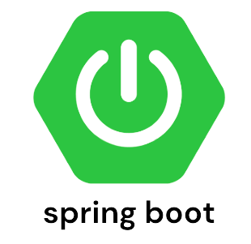

<!--
**oindrila-b/oindrila-b** is a ✨ _special_ ✨ repository because its `README.md` (this file) appears on your GitHub profile.

Here are some ideas to get you started:

- 🔭 I’m currently working on ...
- 🌱 I’m currently learning ...
- 👯 I’m looking to collaborate on ...
- 🤔 I’m looking for help with ...
- 💬 Ask me about ...
- 📫 How to reach me: ...
- 😄 Pronouns: ...
- ⚡ Fun fact: ...
-->

<h2> Hi there </h2>

 

### ✨ I'm Oindrila Banerjee ✨
- I'm a Software Development Engineer, graduated in the year of 2022 with a Bachelor of Engineering in Computer Science and Engineering Degree and I love to work on different tech stacks. 
- Major Tech Stacks I use are : <b> Java, SpringBoot and MySQL.</b>
- But I'm also familiar with : <b>Dart, Flutter, JUnit, Mockito, Node JS, React JS, Docker, Intellij IDE, VS Code, Git. </b>

<h2> 📌 Projects I've been working on recently</h2>

  

    
     
    
      
  

<h2>🔬 Stats of the Github projects </h2>

  

  <b><em>GitHub Stats:</em></b>  
       
 
 ### :hammer_and_wrench: Languages and Tools :

  &nbsp;&nbsp;&nbsp;
  &nbsp;&nbsp;&nbsp;
  &nbsp;&nbsp;&nbsp;
  &nbsp;&nbsp;&nbsp;
  &nbsp;&nbsp;&nbsp;
  &nbsp;&nbsp;&nbsp;
  &nbsp;&nbsp;&nbsp;
  &nbsp;&nbsp;&nbsp;

  

<h2>Connect with me through 🔗</h2>

  
  
  <a href="https://medium.com/@oindrila-b">
    
     

